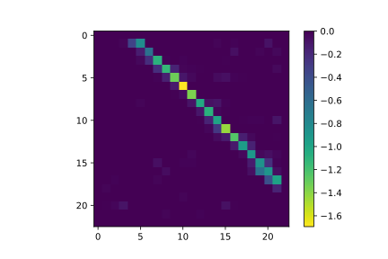
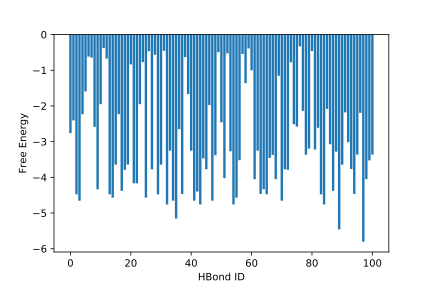
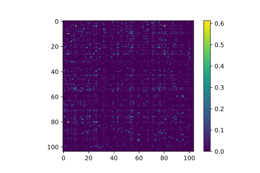

Analysis
========

In this section, as an example, we're going to analyze some of the results from
the simulation to give an example how to use enspara, and how to use an MSM to
generate understanding about a protein's conformational landscape.

First, let's load the representative centers from the clustering:

.. code-block:: python

    import pickle
    import mdtraj as md

    with open('fs-khybrid-clusters0040-centers.pickle', 'rb') as f:
        ctr_structs = md.join(pickle.load(f))

The clustering application saves representative cluster centers as a pickle of
mdtraj trajectory objects. In this case, they all have the same topology, so
we can get away with using `md.join` once pickle has loaded them. (Note,
though, that this can be pretty slow for large lists of trajectories.)

Let's say we're interested in hydrogen bonding patterns in this protein. First,
we used the `MDTraj implementation of the Kabsch Sander hydrogen bond <http://mdtraj.org/1.9.0/api/generated/mdtraj.kabsch_sander.html#mdtraj.kabsch_sander>`_
formulation to compute all the hydrogen bonds in each frame:

.. code-block:: python

    hbonds = md.kabsch_sander(ctr_structs)

This results in a list of ``n x n`` `scipy sparse matrices <https://docs.scipy.org/doc/scipy/reference/sparse.html>`_,
where the element ``i, j`` is the predicted hydrogen bond energy between
residues ``i`` and ``j``. Combining these energies with the probability
estimates from our msm, we can show the mean energy for all possible pairs
of hydrogen bonds throughout the conformational landscape:

.. code-block:: python

    weighted_hbond_mtx = sum(p*h for p, h in zip(m.eq_probs_, hbonds)).todense()
    plt.imshow(weighted_hbond_mtx, cmap='viridis_r')
    plt.colorbar()

As you can see, the highest energy hydrogen bonds are the ``i`` to ``i+4``
hydrogen bonds. This isn't too surprising, since this protein is supposed to
fold up into a helix.

Let's discretize these energies into a bond formed/bond broken binary vector
for each state:

.. code-block:: python

    all_hbonds = set()

    # accumulate all the possible pairs of residues involved in hbonds 
    for i in range(len(ctr_structs)):
        donors, acceptors = np.where(hbonds[i].todense() != 0)
        all_hbonds.update([(d, a) for d, a in zip(donors, acceptors)])
      
    # make a list so that it's ordered  
    all_hbonds = list(all_hbonds)

    # this matrix of length n_states will have each binary feature vector 
    hbond_presence = np.zeros((m.n_states_, len(all_hbonds)),
                              dtype='uint8')

    # set each value i, j to one if state i has hbond j.
    for i in range(len(ctr_structs)):
        donors, acceptors = np.where(hbonds[i].todense() != 0)

        for a, d in zip(donors, acceptors):
            hbond_id = all_hbonds.index((a, d))
            hbond_presence[i, hbond_id] = 1

Then, we can ask what the energy of each of these hydrogen bonds is by
taking the dot product between the equilibrium probability vector and
the feature vector:

.. code-block:: python

    p_hbond = np.dot(m.eq_probs_, hbond_presence)

    plt.bar(np.arange(len(all_hbonds)), height=np.log(p_hbond))
    plt.ylabel("Free Energy")
    plt.xlabel("HBond ID")
    plt.savefig('./hbond-free-energy.svg')

Finally, we might like to know about joint behavior of hydrogen bonds. To do
this, let's use ``enspara``'s ``info_theory`` module:

.. code-block:: python

    from enspara.info_theory import weighted_mi

    hbond_mi = weighted_mi(features=hbond_presence, weights=m.eq_probs_)
    hbond_mi = hbond_mi - np.diag(np.diag(hbond_mi))

    plt.imshow(hbond_mi - np.diag(np.diag(hbond_mi)))
    plt.colorbar()

And we can ask what which pair of hydrogen bonds has the highest MI:

.. code-block:: python

    hbond1, hbond2 = np.unravel_index(hbond_mi.argmax(), hbond_mi.shape)

    def hbond2str(pair, top):
       return '⟶'.join([str(top.residue(i)) for i in pair])

    hbond2str(all_hbonds[hbond1], ctr_structs.top), hbond2str(all_hbonds[hbond2], ctr_structs.top)

which returns ``('ALA14⟶ALA18', 'ALA13⟶ALA17')``, which shouldn't be too
surprising, since the formation of one hydrogen bond probably pays most of the
entropy cost for its neighboring hydrogen bond to form.

There are lots more things you can do with ``enspara``, including
:doc:`transition path theory <../transition-path-theory>`,
:doc:`exposons <../exposons>`,
:doc:`CARDS <../cards>`, and
:doc:`pocket detection <../pocket-detection>`, so make sure to explore our
API documentation!
