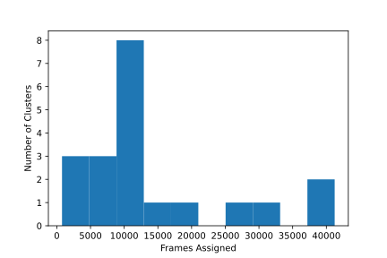

Clustering Trajectories
=======================

The first step to analyzing MD data is usually clustering. For simple to
moderately-complex clustering tasks, we make this pretty straightforward in
``enspara``.

With the :ref:`Clustering CLI <clustering-app>`, you can cluster the data like so:

.. code-block:: bash

    enspara cluster \
      --trajectories trajectory-*.xtc \
      --topology fs-peptide.pdb \
      --algorithm khybrid \
      --cluster-number 20 \
      --subsample 10 \
      --atoms '(name N or name C or name CA)' \
      --distances ./fs-khybrid-clusters0020-distances.h5 \
      --center-features ./fs-khybrid-clusters0020-centers.pickle \
      --assignments ./fs-khybrid-clusters0020-assignments.h5

This will cluster all the trajectories into 20 clusters using the k-hybrid
algorithm based on backbone (atoms named ``N``, ``CA`` or ``C``, per the
`MDTraj DSL <http://mdtraj.org/latest/atom_selection.html>`_) and output
the results (distance, center structures, and assignments) to files named
as specified on the command line (``fs-khybrid-clusters0020*``).

Clustering Outputs
------------------

Clustering this way will output four files,

      #. ``fs-khybrid-clusters0020-centers.pickle`` is a pickle of a python list containing the frames that were at the center of each cluster center. They are given in the order they were discovered by *k*-centers clustering, with 0 being the first frame in the dataset.

      #. ``fs-khybrid-clusters0020-assignments.h5`` is an h5 file containing the assignment of each frame of all trajectories to a cluster center. The value at *t*, *i* gives which cluster center frame *i* in trajectory *t* was assigned to. The *i* values match the centers file.

      #. The distances file ``fs-khybrid-clusters0020-distances.h5`` is an array (``numpy`` in this case) where the value at *t*, *i* gives the distance between frame *i* in trajectory *t* (matching the order of the trajectories given by the ``--trajectories`` flag) and the closest cluster center.

Because these are usually much smaller than your inputs, you can usually drop
into a ipython shell (or even better, jupyter notebook) to inspect your values:

.. code-block:: bash

    $ ipython
    Python 3.6.0 \|Continuum Analytics, Inc.\| (default, Dec 23 2016, 12:22:00)
    Type 'copyright', 'credits' or 'license' for more information
    IPython 6.2.1 -- An enhanced Interactive Python. Type '?' for help.

    In [1]:

Then you can load up these files,

.. code-block:: python

      import pickle

      import mdtraj as md
      from enspara import ra

      assigs = ra.load('fs-khybrid-clusters0020-assignments.h5')
      dists = ra.load('fs-khybrid-clusters0020-distances.h5')

This uses ``enspara``'s ``RaggedArray`` submodule to load the assignments 
and distances files. In this case, all your trajectories are uniform length,
so you will actually get back a ``numpy`` ``ndarray``, but in a more
realistic situation when trajectories have different lengths, this would be a
ragged array.

We can then ask how many frames got assigned to each cluster and make
a plot:

.. code-block:: python

      import matplotlib.pyplot as plt
      import numpy as np

      plt.bar(x=range(0, 20), height=np.bincount(assigs.flatten()))
      plt.xticks(range(assigs.max()+1))
      plt.xlim(-1, assigs.max()+1)
      plt.ylabel('Number of Frames Assigned')
      plt.xlabel('Cluster Index')

And also ask what the distribution of frames per cluster looks like,

.. code-block:: python

      import matplotlib.pyplot as plt
      import numpy as np

      plt.hist(np.bincount(assigs.flatten()))
      plt.ylabel('Number of Clusters')
      plt.xlabel('Frames Assigned')

And, using the distances file, we can compute the distribution of
distances to the nearest cluster center,

.. code-block:: python

      import matplotlib.pyplot as plt

      plt.hist(dists.flatten(), bins=100)
      plt.ylabel('Number of Frames')
      plt.xlabel('Distance to Cluster Center')

.. figure:: distance-to-cluster-center.svg
   :alt: The distribution of distances to the nearest cluster center.

Next, rather than counting raw frames, we can build a Markov State Model,
which does a more rigorous statistical analysis on these data.
