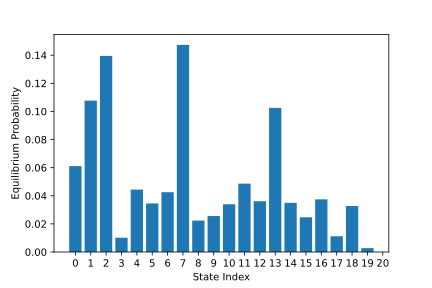
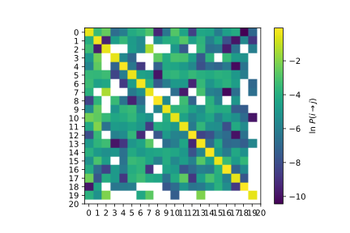

Fitting
=======

Once you've clustered your data, you'll want to build a Markov state model.

Implied Timescales
------------------

One way of assessing the quality of your MSM is to look at the implied
timescales. In particular, this is often used to choose a lag time. Ideally,
your MSM's behavior isn't very dependent on your choice of lag time (i.e. it
satisfies the Markov assumption), and so this is usually a good thing to check.

.. code-block:: python

    from enspara import msm
    import numpy as np

    # make 20 different lag times (integers) evenly spaced between 10 and 750
    lag_times = np.linspace(10, 750, num=20).astype(int)

    implied_timescales = []
    for time in lag_times:
        m = msm.MSM(
            lag_time=time,
            method=msm.builders.transpose)
        m.fit(assigs)

        implied_timescales.append(
            -time / np.log(msm.eigenspectrum(m.tprobs_, n_eigs=3)[0][1:3])
        )

This will calculate the top 3 implied timescales across that range of lag
times. Let's plot it and see how it looks:

.. code-block:: python

    import matplotlib.pyplot as plt

    implied_timescales = np.vstack(implied_timescales)

    for i in range(implied_timescales.shape[1]):
        plt.plot(lag_times, implied_timescales[:, i],
                 label='$\lambda_{%s}$' % (i+1))

    plt.show()

Fitting an MSM
--------------

Once you've got a lagtime you're satisfied with, make an MSM the same way as
before (we also could have stored the old one).

.. code-block:: python

    m = msm.MSM(
        lag_time=10,
        method=msm.builders.transpose))
    m.fit(assigs)

You can then ask quesitons about the conformational landscape you've sampled.
First, let's find out what the equilibrium probability of each state is with
the ``eq_probs_`` parameter fit by the MSM.

.. code-block:: python

    import matplotlib.pyplot as plt

    plt.bar(x=np.arange(m.n_states_), height=m.eq_probs_)
    plt.xticks(range(0, m.n_states_+1))

    plt.xlabel("State Index")
    plt.ylabel("Equilibrium Probability")

.. warning:: Different MSM matrix builders in ``enspara`` output slightly different types. Specifically, some output a numpy ``ndarray`` and others output a scipy sparse matrix. If you get an error calling ``m.tprobs_.toarray()``, check which type you are using.

The MSM also fits a probability of transition between states, which it keeps
in the ``tprobs_`` member variable.

.. code-block:: python

    plt.imshow(np.log(m.tprobs_.toarray()))
    plt.xticks(range(0, m.n_states_+1))
    plt.yticks(range(0, m.n_states_+1))
    plt.colorbar(label=r'ln $P(i \rightarrow j)$')

.. note:: ``enspara`` makes heavy use of sparse matrices!
   In this case (although not always, depending on what method is used to build it)
   the MSM has a sparse `tprobs_`. In this example, we'll convert it to a dense array
   with ``toarray()``, but this is a potentially expensive choice for big MSMs!

Next, we'll analyze the features of the conformational landscape to learn about our protein!
